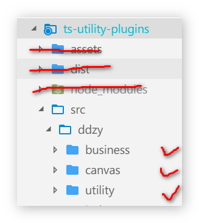

# 如何贡献?

### 说明

充分展示你自己的平台, 无论你是`ts小白`, 还是颇有见地的`大佬`, 都可以:

* 贡献你的代码
* 观摩别人的优秀代码
* 提升你的原生能力

### 前置知识

帮助完善该插件库, 需要一定的基础知识:

* 基本的`Git`命令
  * `git branch`
  * `git checkout`
  * `git fetch` & `git diff` & `git merge`
  * `git push`
* 基本的`Ts`语法
  * `interface`
  * 类型注解
* 基本的`webpack`知识

当然, 对于`封装插件`, 需要具备一点点进阶能力:

* 面向对象基本

其它的, 会在规范要求模块中加以说明.

### 贡献内容

> 可参考[ddzy](https://github.com/ddzy/ts-utility-plugins/tree/master/src/ddzy)

目前来说, 只囊括以下几个区块:

* business   \(`业务`相关\)
* canvas    \(`canvas`特效相关\)
* utility    \(`工具`方法相关\)
  * dom    \(`DOM`方法\)
  * array   \(`数组`方法\)
  * function    \(`函数`方法\)
  * number    \(`数值`方法\)
  * object    \(`对象`方法\)

如果你已经有了明确的贡献内容, 那么`just do it`. 如果你暂时没有明确的目标, 那么可以参考这篇Wiki, 我来给你定目标.

### 具体流程

#### 第一步: 获取

两种方式\(建议使用第二种, 方便省事\)

```bash
# 方式一
git clone https://github.com/ddzy/ts-utility-plugins.git

# 方式二
fork & git clone your.git
```

#### 第二步: 开发

> 开发前请仔细阅读规范要求

**2.1 development**

开发环境中, 由于简单的集成了webpack环境, 所以只需两步：

**1. 启用ts类型检查**

```bash
npm run check
```

**2. 启动开发服务器**

```bash
npm run start
```

**2.2 test**

`5/10`日更新已集成`jest`单测环境, 可按照以下步骤来启动.

**\(1\): 步骤一**

> 修改`jest.config.ts`, 修改`testRegex`条目中的`ddzy\/__tests__`为你自己的路径\(注意: 该路径必须位于你的`bucket`下\).

```typescript
export default {
  testRegex: "(/ddzy\/__tests__/.*|(\\.|/)(test|spec))\\.(jsx?|tsx?)$",
  moduleFileExtensions: ["ts", "tsx", "js", "jsx", "json", "node"],
};
```

**\(2\): 步骤二**

编写相应的测试文件, 命名方式为:

```typescript
*.test.ts
// or
*.spec.ts
```

**\(3\): 步骤三**

启动测试服务器

```bash
npm run test
```

**2.3 product**

生产环境的构建操作, 全部交由[项目owner](https://github.com/ddzy)完成

### 规范要求

#### \(1\): 分支规范

**a. 开发前**

日常提交前, 牢记先同步`原分支`、`origin分支`、`本地分支`.

具体命令可参考[我的博客-原仓库与fork仓库合并](https://blog.yyge.top/blog/2019/03/12/git%E5%B8%B8%E7%94%A8%E5%91%BD%E4%BB%A4%E9%9B%86%E5%90%88/).

**b. 开发中**

项目有两个常驻分支:

* master
* branch/dev

日常的开发必须在`branch/dev`下进行, 可于其下开辟`feature-*`分支, 之后`merge`到`branch/dev`中即可.

**c. 开发后**

个人更改需提交`pr`到`branch/dev`分支.

#### \(2\): 项目规范

**a. 结构**

关于`项目结构`的规范要求, 提出以下几点:

1. 需在`src`下建立`bucket`, 命名为你的`github`用户名.
2. 日常开发只能在你的`bucket`下进行.
3. `bucket`下须有三个大区块:
   * business
   * canvas
   * utility

下面是规范的结构图, 可参考[ddzy](https://github.com/ddzy/ts-utility-plugins/tree/master/src/ddzy):



**b. 代码**

关于coding规范, 个人风格迥异, 不作要求...

**c. README**

一个良好的`README.md`能看出你对该项目的重视、了解程度, 所以请在你的`bucket`下建立一个规范的`README.md`, 帮助别人了解你的项目:

* 做了什么?
* 如何去做?

可参考[ddzy/README.md](https://github.com/ddzy/ts-utility-plugins/blob/master/src/ddzy/README.md)

#### \(3\): 提交规范

良好的commit, 既能方便查阅历史提交, 又赏心悦目, 何乐而不为?

> 具体请参考[angular规范](https://www.jianshu.com/p/1537e821eac9)

想在`commit`中添加可爱的emoji?

> 参考: [在git commit中添加表情](https://www.jianshu.com/p/bb26733da917)

### 注意事项

如果你的项目`README.md`过于冗长, 可以考虑提取至其它在线站点——`Gitbook`、`Vuepress`都是非常不错的选择!

### Q&A

待补充...

